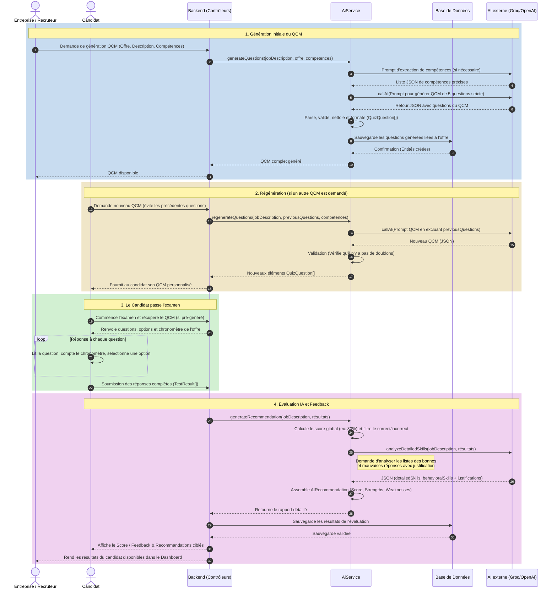

# Diagramme de Séquence : Génération, Examen et Feedback QCM

Ce diagramme de séquence illustre de manière détaillée les interactions entre un candidat (ou l'entreprise), l'API du Backend, le service d'Intelligence Artificielle de votre application ([AiService](file:///c:/Users/aya%20labyedh/Desktop/PFE/Backend/src/ai/ai.service.ts#41-704)) et l'API externe (par exemple Groq ou OpenAI). Il couvre l'ensemble du cycle de vie d'un quiz, de sa création à la restitution du feedback.

### Explications des étapes clés basées sur votre code :
1. **Génération (Questions avec Retry) :** L'AI (Groq/OpenAI) est d'abord interrogée pour obtenir des compétences précises sur la description du poste. Ensuite, on envoie le prompt massif avec les règles de génération strictes. S'il ne renvoie pas un format viable, l'API bascule (_retry / rotation des modèles_) sur différents modèles Groq pour essayer d'avoir un JSON sans timeout.
2. **Régénération :** La fonction [regenerateQuestions](file:///c:/Users/aya%20labyedh/Desktop/PFE/Backend/src/ai/ai.service.ts#560-578) envoie intentionnellement l'historique de passage (les anciennes questions) pour forcer le LLM à créer un jeu de données unique à 100%. 
3. **Examen en cours :** L'objet _TestResult_ contiendra la "question posée", la "selectedAnswer", et la vraie "correctAnswer".
4. **Feedback (Recommandations et compétences spécifiques) :** Après un calcul déterministique (pour sécuriser le fonctionnement et obtenir un taux de réussite via `score`), l'API bascule vers la fonction [analyzeDetailedSkills()](file:///c:/Users/aya%20labyedh/Desktop/PFE/Backend/src/ai/ai.service.ts#643-693). Cette méthode effectue du _Skill Extraction_ : elle demande exactement pourquoi un candidat a échoué (ou réussi) et l'IA donne un JSON contenant des notes par technologies précises (ex: `JavaScript: 70`, `Problem Solving: 100`).
